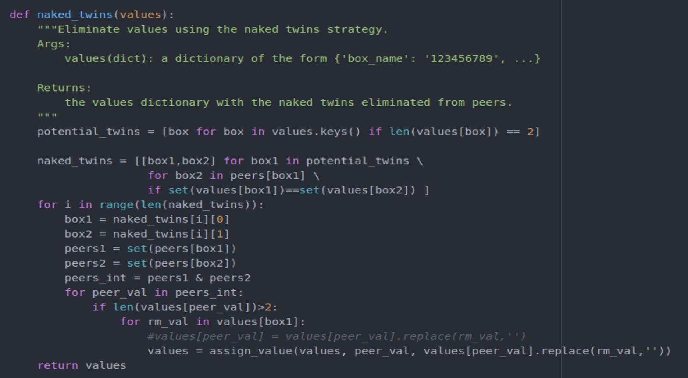
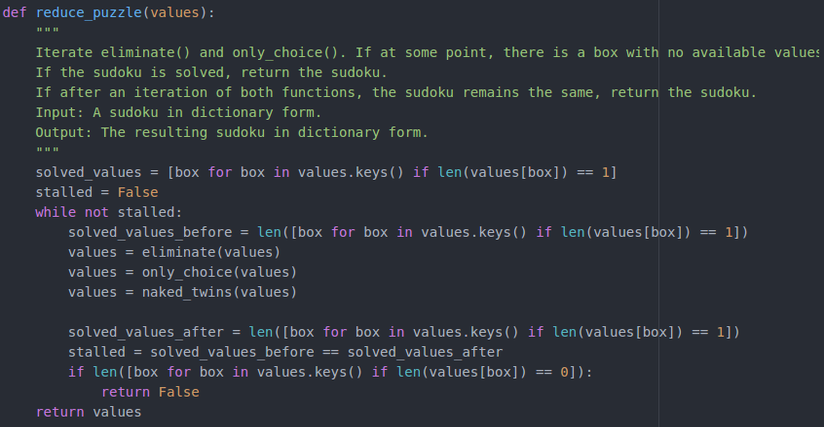
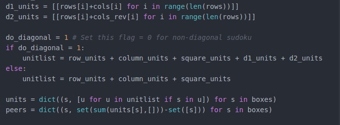

# Artificial Intelligence Nanodegree
## Introductory Project: Diagonal Sudoku Solver

In this project we will go over the solution to solve sudoku using naked-twin strategy. Further we will extend the solution to solve for diagonal sudoku where the diagonals of the board are constraint to have all the numbers between 1 and 9. To test the solution, run 

  python solution_test.py

To test solution, run 
  python solution.py

#### Question 1 (Naked Twins)
Q: How do we use constraint propagation to solve the naked twins problem?  
A: Constraint propagation is the idea of applying the same constraint as many times as possible until a solution is obtained, or the constraint can no longer be applied to refine the solution.

In sudoku, we apply naked twins as a strategy to reduce the number of possibilities. Naked twins is the strategy is illustrated in the figure below. The strategy is to identify a pair of boxes belonging to the same set of peers that have the same 2 numbers as possibilities, and eleminate these two numbers from all the boxes that have these two boxes as peers.

This method was implemented in Python using a set intersection function. First we identify all boxes that have only 2 elements. Next we identify which boxes among these have the same elements to get naked twins. Once we get the naked twins, we remove the corresponding digits from all the boxes that are peers to both the twins. This is illustrated in the code snippet below.

We use naked_twins in conjunction with eliminate and only-choice to reduce the number of possibilities as shown in the reduce_puzzle snippet below.

#### Question 2 (Diagonal Sudoku)
Q: How do we use constraint propagation to solve the diagonal sudoku problem?  
A: For diagonal sudoku, the easiest way to incorporate diagonal contraint was to include it as an additional unit in sudoku. Once this is done, all the diagonal entries will have the corresponding diagonal entries as their peers. This will result in not accepting solutions that do not satisfy the diagonal constraint. The code snippet below presents the method of implementing diagonal constraint.

